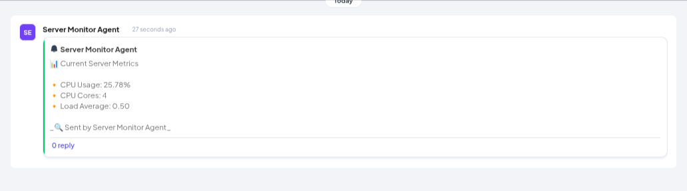

# Telex Server Monitor

A server monitoring integration that helps system administrators track server health, detect anomalies, and receive alerts via the Telex platform. The integration consists of an agent installed on your server that collects and reports key metrics to Telex.

[](https://github.com/yourusername/telex-server-monitor)
[](https://opensource.org/licenses/ISC)

## Features

### Version 1.0

- **Telex Integration**: Seamless registration within your Telex organization
- **Agent Installation**: Simple installation via Telex-generated script
- **CPU Usage Tracking**: Real-time monitoring of total CPU usage
- **Default Threshold Alerts**: Automatic alerts when CPU usage exceeds 85%

## Prerequisites

- Linux, macOS, or other Unix-like operating system
- Root/sudo access (for installation)
- Minimum 512MB RAM
- 100MB free disk space

## Installation

### Quick Install (Recommended)

1. In your Telex channel, run:

```bash
/setup-monitoring
```

2. Copy the installation command provided by Telex and run it on your server:

```bash
curl -sSL https://telex.example.com/install/<unique-token> | sudo bash
```

The installation script will:

- Download and install the monitoring agent
- Configure authentication automatically
- Set up initial monitoring settings
- Start the monitoring service

#### Usage

```bash
# Check monitoring status
sudo systemctl status telex-monitor

# Stop monitoring
sudo systemctl stop telex-monitor

# Start monitoring
sudo systemctl start telex-monitor

# Restart monitoring
sudo systemctl restart telex-monitor
```

### Local Development or Machine Setup

To set up the project locally, follow these steps:

1. Clone the repository from GitHub:

```bash
git clone https://github.com/telexintegrations/server-monitor-telex-integration.git
```

2. Navigate into the integrations folder and install dependencies:

```bash
cd server-monitor-telex-integration/integrations
npm install
```

3. Navigate into the package folder and install dependencies:

```bash
cd ../package
npm install
```

4. Move to the shell-scripts directory:

```bash
cd ../shell-scripts
```

5. Grant execution permissions to the startup script and run startup script:

```bash
chmod +x start-dev.sh
bash start-dev.sh --channel-id <channel-id>

```

6. The application will be live on port: `3002`

### Simulating Requests

To simulate a request from Telex to the `/tick` endpoint, use Postman or cURL:

```bash
curl --location 'http://localhost:3002/tick' \
--header 'Content-Type: application/json' \
--data '{
     "channel_id": "<your-test-telex-channel-id>",
    "return_url": "https://ping.telex.im/v1/return/<your-test-telex-channel-id>",
   "settings": [
        {
        "label": "interval",
        "type": "text",
        "required": true,
        "default": "* * * * *"
      }
    ]
}'
```

If the setup is successful, you will receive a notification of your server metrics in the specified Telex channel.


### Configuration

All configuration is managed through the Telex platform:

- CPU usage threshold (default: 85%)
- Alert channel settings
- Monitoring status (on/off)

### Logs

Logs are stored in `/var/log/telex-monitor/`:

- `telex-monitor.log`: General logs
- `error.log`: Error logs only

## Architecture

```
┌─────────────┐         ┌─────────────┐         ┌─────────────┐
│   Your      │         │ Integration │         │   Telex     │
│   Server    │◄───────►│   Server    │◄───────►│  Platform   │
│             │   ZMQ   │             │   HTTP  │             │
└─────────────┘         └─────────────┘         └─────────────┘
```

## Troubleshooting

Common issues and solutions:

1. **Installation Failed**

   - Ensure you have root/sudo access
   - Check your network connection
   - Verify the installation token is valid

2. **Agent Not Reporting**
   - Check if the service is running: `sudo systemctl status telex-monitor`
   - Verify network connectivity
   - Check logs for errors: `tail -f /var/log/telex-monitor/error.log`

## License

ISC © [JC-Coder](https://github.com/jc-coder)
[Knowledge-JO](https://github.com/Knowledge-JO)
